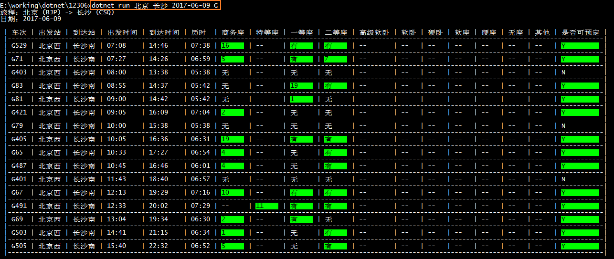

# 12306火车票查询工具

## 参数

起点站 到达站 [时间] [列车类型（G,C,D,Z,T,K），多个用（英文半角逗号）隔开] [排序方式(1<出发时间升序>,2<到达时间升序>,3<历时升序>)]

### 常规查询

`./12306 北京 天津 2017-06-08 G,D,Z,T 3`
`./12306 北京 天津 now G,D,Z,T 3` 可用now代表现在时间

### 精确车站查询

只需要在车站名称前加上^符号即可

`./12306 ^北京 天津 2017-06-09 G`

## 截图

## TODO

- [x] 参数指定排序方式（出发到达时间，历时）

## 开发

### 安装依赖
`dotnet restore`

### 运行调试
`dotnet run 北京 天津 2017-06-08 G,C,D,Z,T`

### 发布
`dotnet publish -c Release -r <RUNTIME_IDENTIFIER>`

更多RUNTIME_IDENTIFIER请参阅：
[.NET Core 运行时标识符 (RID) 目录](https://docs.microsoft.com/zh-cn/dotnet/core/rid-catalog)

常用：
- `dotnet publish -c Release -r win10-x64`
- `dotnet publish -c Release -r centos.7-x64`
- `dotnet publish -c Release -r osx.10.12-x64`
